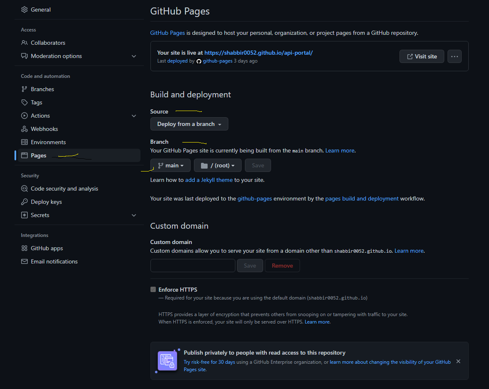

Repository : https://github.com/shabbir0052/api-portal

setting up of the git hub pages 
   On the repository got ot setting --> pages, 
    Source deploy from <branch>
    Select the branch you would like to deploy :- <select the branch>

  Refer the fiugre
      

Git hub pages url :- https://shabbir0052.github.io/api-portal/
